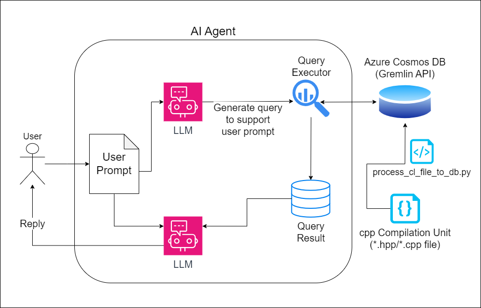

## C++ Codebase AI Agent with AST-based RAG

This repository contains a prototype for an **AI-powered chatbot agent** that answers questions about a C++ codebase. 

**Microsoft Azure OpenAI**-based Chatbot generates answers based on Abstract Syntax Tree (AST) of a C++ compilation unit as the primary source of information. 

Using AST for **retrieval-augmented generation (RAG)** enables **precise and complete** answers about the codebase.

Code AST is a graph structure, retrieved using **clang** libraries, and partially stored in **Microsoft Azure Graph Cosmos DB**.



## Table of Contents

- [Overview](#overview)
- [Tests](#tests)
- [Usage](#usage)
- [Setup](#setup)
- [License](#license)

## Overview

This project consists of two main components:

1. **AST Processing & Storage**: A Python script that processes C++ source files using `clang`, extracts the AST (Abstract Syntax Tree), and stores a partial representation of the AST in **Azure Cosmos DB (Gremlin API)**.

2. **AI Chatbot Agent**: A Python-based chatbot agent that answers user questions about the C++ codebase by querying the AST stored in **Azure Cosmos DB** and using **Azure OpenAI** models to generate accurate answers.

### 1. **AST Processor (process_cl_file_to_db.py)**:
   
   - This script uses `clang` to parse the C++ source file and extract its AST.
   
   - The AST is then processed and some chosen parts of it are stored in **Azure Cosmos DB (Gremlin API)**.
   
### 2. **AI Chatbot Agent (test_the_idea.py)**:
   
   - The chatbot is designed to answer questions about the C++ codebase by querying the AST stored in Cosmos DB.
   
   - **Azure OpenAI** is used to:
   
     - **Generate Gremlin Queries**: The chatbot uses a GPT model to translate natural language questions into Gremlin queries.

     - **Provide Answers**: After retrieving the results from Cosmos DB, the model composes a coherent and informative answer to the user’s question.
   
   - **RAG**: The chatbot uses the retrieved graph data to augment the generated answers, ensuring accurate and relevant responses.

## Tests

Results of some testing with open-source C++ solutions.

### Testing with nlohmann/json (https://github.com/nlohmann/json)

Input compilation unit: include/nlohmann/json.hpp

1) User prompt: **what namespaces exist in this package?**

Generated Gremlin Query:
 g.V().hasLabel('NAMESPACE').project('id', 'spelling').by(id).by('spelling')

Code Advisor Answer:
 The package contains the following namespaces:

1. `nlohmann`
2. `nlohmann::json_abi_v3_11_3`
3. `nlohmann::json_abi_v3_11_3::detail`
4. `nlohmann::json_abi_v3_11_3::detail::utility_internal`
5. `nlohmann::json_abi_v3_11_3::detail2`
6. `nlohmann::json_abi_v3_11_3::detail::impl`
7. `nlohmann::json_abi_v3_11_3::detail::container_input_adapter_factory_impl`
8. `nlohmann::json_abi_v3_11_3::detail::dtoa_impl`
9. `nlohmann::json_abi_v3_11_3::literals`
10. `nlohmann::json_abi_v3_11_3::literals::json_literals`
11. `std`

**Conclusion**: Using AST as RAG mechanism all the namespaaces were found, classic RAG over files would be limited by the number of search results that RAG supports.  

2) User prompt: **what classes have 'exception' substring in their identifiers ?**

Generated Gremlin Query:
 g.V().hasLabel('CLASS_DECL', 'CLASS_TEMPLATE', 'CLASS_TEMPLATE_PARTIAL_SPECIALIZATION')
    .has('spelling', TextP.containing('exception'))
    .project('id', 'label', 'spelling')
        .by(id())
        .by(label())
        .by('spelling')

Code Advisor Answer:
 The following classes have the substring 'exception' in their identifiers:

1. `nlohmann::json_abi_v3_11_3::detail::exception`
2. `std::exception`

**Conclusion** 'Allowed Gremlin Steps' are important to mention in the system message when requesting to compose a query

3) User prompt: **what classes inherit (also recursively) exception?**

Generated Gremlin Query:
 g.V().hasLabel('CLASS_DECL').as('class')
.repeat(out('inherits').hasLabel('CLASS_DECL').simplePath())
.until(out('inherits').count().is(0))
.path().by('id')

Code Advisor Answer:
 The following classes inherit (either directly or indirectly) from the `std::exception` class:

1. `nlohmann::json_abi_v3_11_3::detail::exception`
2. `nlohmann::json_abi_v3_11_3::detail::parse_error`
3. `nlohmann::json_abi_v3_11_3::detail::invalid_iterator`
4. `nlohmann::json_abi_v3_11_3::detail::type_error`
5. `nlohmann::json_abi_v3_11_3::detail::out_of_range`
6. `nlohmann::json_abi_v3_11_3::detail::other_error`

These classes form an inheritance chain where `nlohmann::json_abi_v3_11_3::detail::exception` directly inherits from `std::exception`, and the other classes inherit from `nlohmann::json_abi_v3_11_3::detail::exception`.

**Conclusion** I don't understand this one. The query has no string "exception". 
**Conclusion** Recursive relations can be found.

4) User prompt:
 list me all functions (including template) to_json overloads and list of their parameters

Generated Gremlin Query:
 g.V().hasLabel('FUNCTION_DECL', 'FUNCTION_TEMPLATE').has('spelling', 'to_json').as('function')
  .out('contains_argument').as('param')
  .select('function', 'param')
  .by(valueMap('id', 'label', 'usr', 'spelling', 'tu', 'file', 'line'))
  .by(valueMap('id', 'label', 'usr', 'spelling', 'tu', 'file', 'line'))

Code Advisor Answer:
 Here is a list of all `to_json` function overloads along with their parameters:

Function: `to_json`
   - Parameters: `j`, `b`
   - File: `include_nlohmann_detail_conversions_to_json.hpp`
   - Line: 265

Function: `to_json`
   - Parameters: `j`, `b`
   - File: `include_nlohmann_detail_conversions_to_json.hpp`
   - Line: 278

... and 18 more functions in the output message...

**Conclusion** Still quite some work to do for fully working system, i.e. system message for the answer-generating LLM has to be fine-tuned (no need to spam with filenames); system message for the query composing LLM has to be fine-tuned - teach it that functions and template functions are similar concepts, etc .... 
  
## Usage

### Common Use Cases:

- Query the C++ codebase for classes, methods, or namespaces.

- Retrieve details about specific code elements or patterns within the codebase (e.g., functions containing a specific substring).

- Navigate relationships in the codebase, such as class inheritance or method definitions.

### Future Use Cases:

- AI Agent/Assitant that does the refactoring for you

## Setup

### Prerequisites

1. **Azure Cosmos DB (Gremlin API)**: You will need an Azure Cosmos DB instance with Gremlin API enabled for storing and querying the C++ AST.

2. **Azure OpenAI Service**: You'll need access to Azure's OpenAI services to run the chatbot.

3. **Clang**: Make sure `libclang` is available for parsing the C++ files.

### Steps to Set Up the Project:

1. **Clone the Repository**:
    ```bash
    git clone https://github.com/yourusername/yourrepository.git
    cd yourrepository
    ```

2. **Install Dependencies**:
   You can install the required dependencies using `pip`:
    ```bash
    pip install -r requirements.txt
    ```

4. **Set Up Azure Services**:
   - Set up **Azure Cosmos DB** and **Azure OpenAI** following their respective documentation.
   - Populate your `.env` file with the required connection information for **Azure Cosmos DB** and **Azure OpenAI API keys**.

6. **Run the C++ AST Processor**:
    - Ensure that you have a C++ source file ready for processing.
    - Run `process_cl_file_to_db.py` to fill the Cosmos DB with the AST:
    ```bash
    python process_cl_file_to_db.py
    ```
    
8. **Run the AI Chatbot**:
    - You can test the AI chatbot agent by running the `test_the_idea.py` script:
    ```bash
    python test_the_idea.py
    ```

## License

This project is licensed under the MIT License - see the [LICENSE](LICENSE) file for details.
